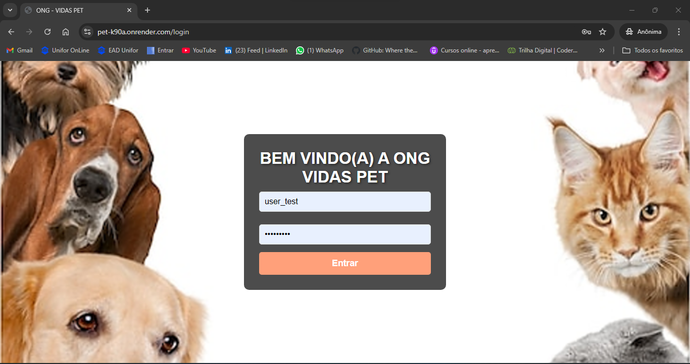
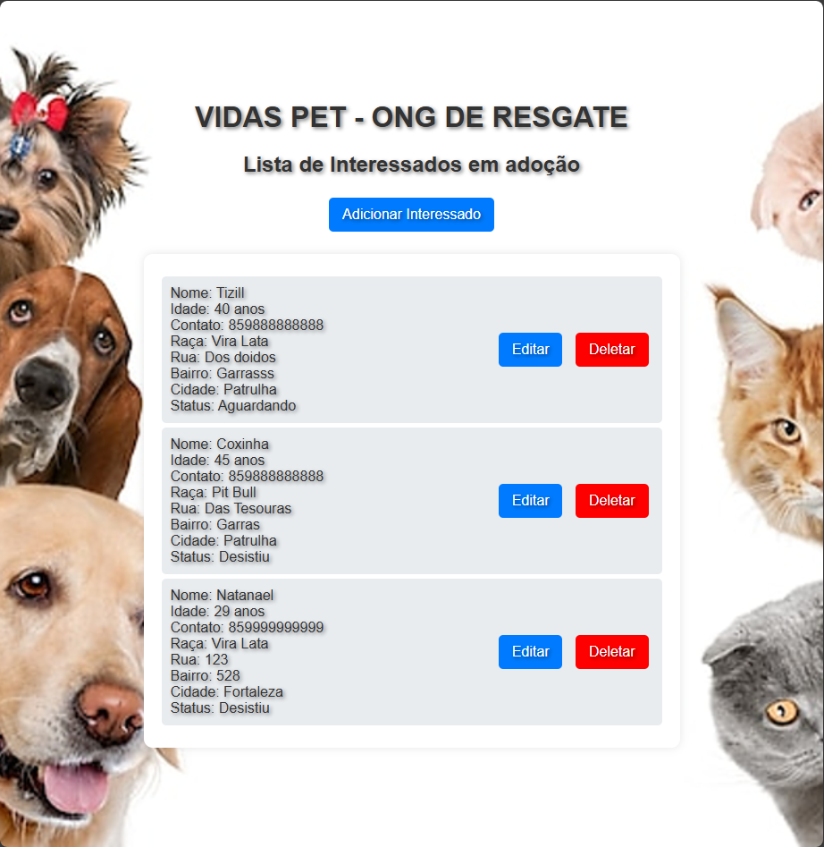
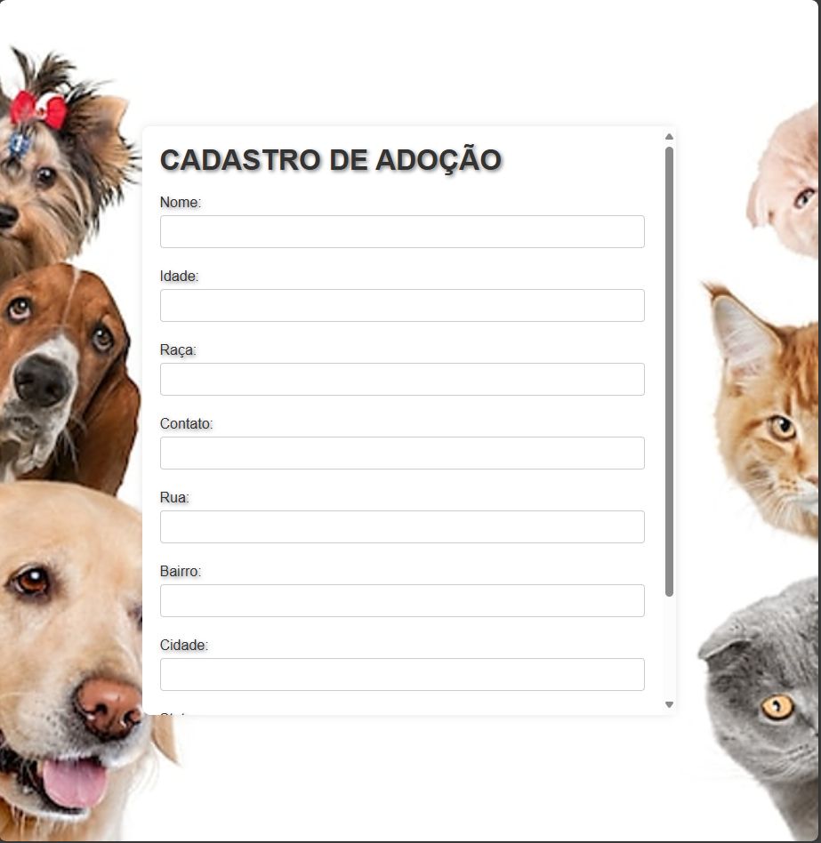

N708-Proj aplic multiplataforma etapa 2.

Projeto prático de site para cadastro de interessados em adotar pets da ong  ONG VIDAS PET  

* Aplicação criada com HTML, CSS, Python, Flesk e Mongo DB. 
 --> Font End: HTML, CSS 
 --> Back-end: Python, Flask 
 --> Banco de dados: MongoDB  

 * O site está hospedado de forma gratuita no RENDER, caso o link abaixo demore a carregar, gentileza seguir os passos abaixo: 
 --> No terminal,  na pasta projeto, rodar o comando: pip install -r requirements.txt para instalar todas as dependências necessárias para rodar o projeto localmenete (lembrando que para rodar de formar local é necessário ter o python instalado na máquina). 
 --> Executar o arquivo app.py e assim abrirar a tela do seu navegador com a aplicação. 
 * Link: https://pet-k90a.onrender.com   

* Tela de Login - WEB: 
 

* Tela Principal - WEB: 
 

* Tela de Cadastro de Amigo - WEB: 
 

* Tela de Edição de Amigo - WEB: 
 

* Boatão de Exclusão - WEB: 
 

* Para entra no site é necessário usuário e senha, gentileza utilizar as credenciais abaixo:

* login = user_test 
* senha = user_test 
